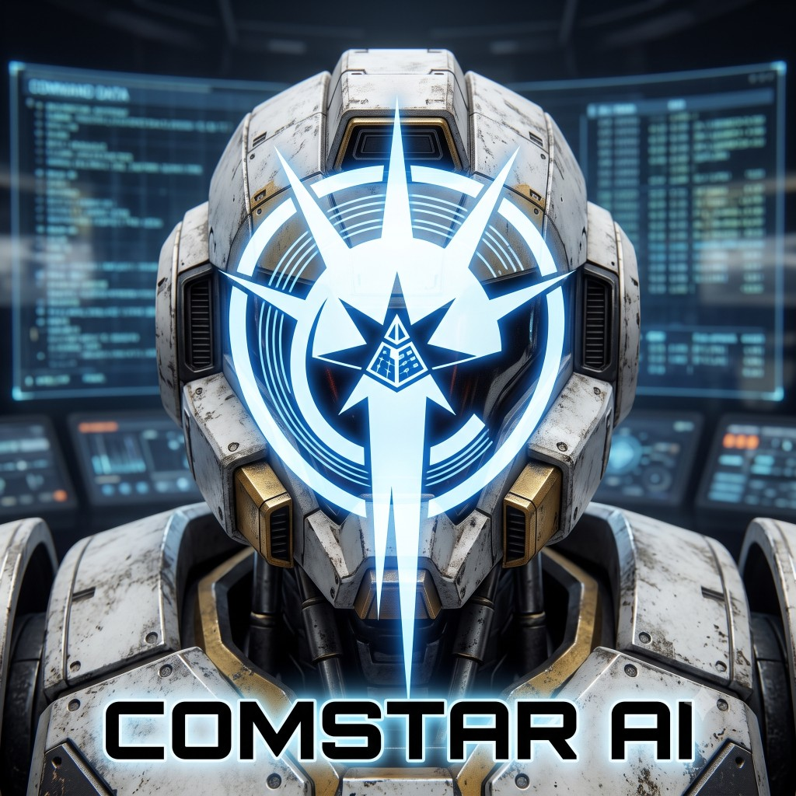
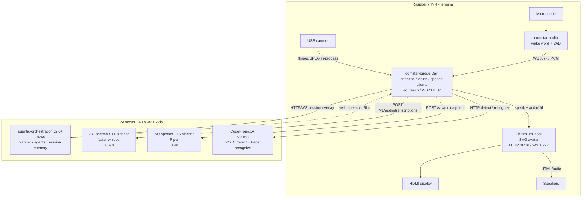

<p align="center">
  
</p>

<h1 align="center">COMSTAR AI</h1>

<p align="center">
  <em>An always-on, embodied AI presence for your home.<br>
  It sees you, knows you, listens for you, and answers with a face.</em>
</p>

<p align="center">
  
  
  
  
</p>

---

## Table of contents

- [What COMSTAR is](#what-comstar-is)
- [Why it exists](#why-it-exists)
- [Architecture](#architecture)
- [The attention model](#the-attention-model)
- [Hardware](#hardware)
- [Software stack](#software-stack)
- [Repository layout](#repository-layout)
- [Prerequisites](#prerequisites)
- [Installation](#installation)
- [Configuration](#configuration)
- [Enrolling a face](#enrolling-a-face)
- [Training the wake word](#training-the-wake-word)
- [MCP topology](#mcp-topology)
- [Latency budget](#latency-budget)
- [Privacy model](#privacy-model)
- [Roadmap](#roadmap)
- [Design decisions](#design-decisions)
- [Troubleshooting](#troubleshooting)
- [Credits and licensing](#credits-and-licensing)

---

## What COMSTAR is

COMSTAR is a physical AI terminal. A small screen on a Raspberry Pi, a camera, a microphone, and a speaker. It runs continuously. When you walk into frame it recognises you, greets you by name, and waits. You ask it something. A 3D avatar answers you out loud.

Behind that is [`agentic-orchestration`](https://github.com/zlatko-lakisic/agentic-orchestration) — a CrewAI-based, model-agnostic orchestration engine with dynamic planning, per-task MCP integration, a SQLite knowledge base, session memory, and a learning loop. COMSTAR is a face for that engine, not a wrapper around a chatbot.

The client talks to the engine through [`agentic-orchestration-reach`](https://github.com/zlatko-lakisic/agentic-orchestration-reach) (AO Reach), which gives it ephemeral per-session agents and a WebSocket reverse tunnel for exposing local tools to the orchestrator.

Everything runs on your own hardware. No cloud dependency, no API keys required, no vendor lock-in.

---

## Why it exists

Proto Hologram proved the thesis: an embodied presence in a room is categorically different from a video call or a text box. People walk up to it. People talk to it without being prompted. But Proto is $10k–$250k of proprietary hardware running a closed OS, and you cannot put your own agent logic behind it.

COMSTAR is the open version. Commodity parts, a GPU you already own, and an orchestration engine you can rewrite.

**Design principles:**

| | |
|---|---|
| **Local by default** | Phase 1 inference stays on LAN. Enabling the M11 text channel deliberately sends chat text via Telegram (see Privacy model). |
| **Thin client, fat brain** | The Pi does I/O (capture, wake, VAD, kiosk, playback). Speech compute prefers AO-advertised sidecars on the AI server; local STT/TTS remain a fallback. |
| **Identity is the session** | Face recognition isn't decoration — it selects the AO session and its memory. |
| **The room is a tool** | Presence and vision are MCP tools the planner can call, not context you prepend. |
| **Latency is a feature** | If a response takes longer than ~15s, the interaction is broken. Budget accordingly. |

---

## Architecture



| Runs on the Pi | Runs on the AI server |
|---|---|
| Camera grab, mic, wake, VAD, kiosk, playback | CodeProject.AI (YOLO + face) |
| Bridge (attention + clients); optional local STT/TTS fallback | agentic-orchestration `:8765` + speech sidecars `:8090`/`:8091` |
| | Hosted MCPs (e.g. Home Assistant) |

**The split:** the Pi captures and plays. The server thinks (AO), sees (CPAI), and — when speech is enabled — transcribes/synthesizes via AO-advertised sidecars (`SessionBridge.speechClient`). Env `COMSTAR_STT_URL` / `COMSTAR_TTS_URL` remain for Mac/dev and when Ada speech is off. The kiosk has no camera preview — the bridge owns the camera for vision only.

---

## The attention model

"Always on" is not a boolean. COMSTAR climbs a ladder of attention states, each with a different cost and a different tolerance for false positives.

| State | Trigger in | What's running | What's captured |
|---|---|---|---|
| **Ambient** | idle | wake word model, low-rate presence polling | nothing persisted |
| **Noticed** | YOLO `person` class in frame | presence tracking | nothing persisted |
| **Engaged** | face match returns a known `userid` | AO session opened under that identity | greeting emitted |
| **Listening** | wake word · follow-up window · face-attention | VAD; utterance sent to STT after silence | utterance only |
| **Responding** | end of speech, ~700ms silence | orchestration → TTS → avatar | response + transcript to session |

**Transitions worth understanding:**

- **Ambient → Noticed** fires on the YOLO `person` class, never on motion. Motion triggers on curtains and pets.
- **Noticed → Engaged** is the moment that carries the whole product. You walked into frame and it addressed you by name without being summoned.
- **Engaged → Listening** has three doors. The wake word `hey comstar` (four syllables, which buys a much lower false-accept rate than a two-syllable word). A **follow-up window** of 8–10 seconds after any response, during which no wake word is needed. And optionally **face-attention** — a matched face looking at the screen while speaking counts as being addressed. That third door is behind a feature flag, because it is the difference between magic and an assistant that answers your phone calls.
- **Responding → Ambient** decays after the follow-up window closes and the person leaves frame.

Identity is cached with a TTL bound to continuous presence. Face recognition runs on transition, not per frame.

---

## Hardware

| Component | Part | Notes |
|---|---|---|
| Terminal | Raspberry Pi 4 (4GB+) | 8GB recommended if rendering the avatar locally |
| Camera | Logitech USB webcam | Any UVC camera; used for vision only |
| Microphone | **ReSpeaker 2-Mic / 4-Mic array** or USB conference puck | *Strongly recommended over the webcam's built-in mic* — see below |
| Display | Small HDMI panel | 800×480 to 1280×720 |
| Audio out | USB or 3.5mm powered speakers | |
| Brain | AI server with NVIDIA RTX 4000 Ada | Runs AO + CodeProject.AI (vision). Speech is on the Pi. |
| Network | Wired ethernet to the Pi | Wi-Fi adds jitter to the frame stream |

> **On the microphone.** The webcam's built-in mic is the weakest link in the entire build. Those capsules are tuned for a face 40cm away. At 2–3m across a room with any reverb, wake-word accuracy falls off a cliff. A beamforming array will do more for the felt quality of this project than any other single upgrade. Keep the webcam for vision, add a separate mic for audio.

---

## Software stack

| Layer | Choice | Rationale |
|---|---|---|
| Client SDK | `ao_reach` ≥ 0.5.2 (Dart ^3.5) | Session overlays + reverse MCP; required `appId` (`ComStar`) |
| Client shell | Dart bridge + Chromium kiosk | Bridge speaks REACH; kiosk renders the avatar; they talk over local WS |
| Avatar (Phase 1) | Live SVG starburst in Chromium | State, mic level, speech amplitude; no WebGL yet |
| Avatar (planned) | [TalkingHead.js](https://github.com/met4citizen/TalkingHead) + GLB | Lip-sync path reserved; GLB UAT still open |
| Vision | **CodeProject.AI Server** (`:32168`) | Already deployed, CUDA-backed, serving house cameras |
| Wake word | [openWakeWord](https://github.com/dscripka/openWakeWord) | Free, local, custom words trainable from synthetic audio |
| VAD | Energy VAD (Silero optional) | End-of-speech with start/continue hysteresis for fast talk |
| STT | AO speech sidecar (Reach `SpeechClient`) or local faster-whisper | Prefer Ada when `hello.speech`; env URL fallback |
| TTS | AO speech sidecar or local Piper/sherpa | OpenAI-compatible `/v1/audio/speech` |
| Orchestration | [`agentic-orchestration`](https://github.com/zlatko-lakisic/agentic-orchestration) ≥ v2.0.0 | Planner, agents, MCP, KB; Reach `appId` required; speech advertise ≥ 1.28 |

---

## Repository layout

```
comstar/
├── docs/
│   ├── comstar-banner.png
│   ├── RUNBOOK.md
│   └── adr/                     # architecture decision records
├── terminal/                    # everything that runs on the Pi
│   ├── bridge/                  # Dart — attention, vision, speech routing, ao_reach
│   │   ├── bin/comstar_bridge.dart
│   │   ├── lib/
│   │   │   ├── session.dart     # SessionBridge lifecycle + identity headers
│   │   │   ├── speech_routing.dart  # Prefer Reach SpeechClient; env URL fallback
│   │   │   ├── attention/       # state machine + coordinator
│   │   │   ├── vision/          # ffmpeg camera + CodeProject.AI client
│   │   │   └── local_ws.dart    # 127.0.0.1 WS for kiosk (:8777) + audio (:8778)
│   │   └── pubspec.yaml
│   ├── audio/                   # Python — wake word, VAD, capture
│   │   ├── wakeword.py
│   │   ├── vad.py
│   │   └── __main__.py
│   └── kiosk/                   # web — SVG avatar (TalkingHead/GLB planned)
│       ├── index.html
│       └── avatar.js
├── overlays/                    # AO session overlay definitions
│   └── comstar/
│       └── agent_providers/
│           ├── voice_responder.yaml
│           └── greeter.yaml
├── mcp/                         # MCP shims
│   ├── vision_mcp/              # wraps CodeProject.AI for the orchestrator
│   └── terminal_mcp/            # Pi-local: display, speaker, mic state
├── config/
│   ├── comstar.example.yaml
│   ├── comstar.dev.example.yaml
│   └── comstar.mac.env.example  # Mac device template → copy to comstar.mac.env (gitignored)
├── testdata/stt/                # STT golden + live-bridge fixtures + bench harness
└── scripts/
    ├── enroll_face.sh
    ├── stt_server_whisper.py    # production Pi STT (faster-whisper)
    ├── tts_server.py            # production Pi TTS (sherpa Piper)
    └── train_wakeword.py
```

---

## Prerequisites

**On the AI server:**

- `agentic-orchestration` daemon **≥ v1.27.0** with:
  ```bash
  export AGENTIC_SERVE_SESSION_OVERLAY=1
  export AGENTIC_SERVE_MCP_TUNNEL=1
  ```
- CodeProject.AI Server reachable on `:32168`, with both the **Object Detection** and **Face Processing** modules installed and confirmed running on CUDA. Check the dashboard at `http://<server>:32168` — the Face module is more prone than Object Detection to silently falling back to CPU.

**On the Pi:**

- Raspberry Pi OS 64-bit (Bookworm or later)
- Dart SDK ^3.5
- Python 3.11+ (3.12 preferred for `.venv-stt`)
- Node.js (only if using `LocalMcpHost` to spawn stdio MCPs via `npx`)
- Chromium
- Local speech units: `comstar-stt` (faster-whisper) + `comstar-tts` (Piper/sherpa)

---

## Installation

```bash
git clone https://github.com/zlatko-lakisic/comstar.git
cd comstar
```

**1 — Bridge (Pi)**

```bash
cd terminal/bridge
dart pub get
dart compile exe bin/comstar_bridge.dart -o /usr/local/bin/comstar-bridge
```

**2 — Audio (Pi)**

```bash
cd terminal/audio
python3 -m venv .venv && source .venv/bin/activate
pip install -r requirements.txt
```

**3 — Kiosk (Pi)**

```bash
cd terminal/kiosk
npm install
```

**4 — Register the overlay**

The bridge registers `client.*` agents with the AO daemon at session start, from `overlays/comstar/agent_providers/*.yaml`. These are ephemeral — they exist for the life of the session and are not mounted on the host.

**5 — Run**

```bash
systemctl --user enable --now comstar-bridge comstar-audio comstar-kiosk
systemctl --user enable --now comstar-stt comstar-tts
```

---

## Configuration

`config/comstar.yaml`:

```yaml
orchestration:
  base_url: https://ao.lan
  ttl_seconds: 3600
  timeout_seconds: 15
  overlay_root: ./overlays/comstar

vision:
  codeproject_url: http://ai-server.lan:32168
  detection_endpoint: /v1/vision/detection
  recognize_endpoint: /v1/vision/face/recognize
  ambient_fps: 1              # polling rate while idle
  engaged_fps: 3              # polling rate while a person is present
  person_confidence: 0.60
  face_confidence: 0.55
  recognize_votes: 3          # consensus frames before accepting an identity
  identity_ttl_seconds: 300

audio:
  wakeword_model: ./models/hey_comstar.onnx
  wakeword_threshold: 0.55
  vad_silence_ms: 700
  max_utterance_seconds: 15
  followup_window_seconds: 10
  duplex: half                # half | full  (full requires AEC)

avatar:
  render: local               # local | streamed
  model: ./assets/comstar.glb
  tts: piper
  piper_voice: en_US-ryan-high

attention:
  face_attention_trigger: false   # experimental — see notes
  stranger_mode: restricted       # restricted | greet | ignore
```

### Device and speech environment

| Variable | Purpose | Examples |
|---|---|---|
| `COMSTAR_CAMERA_SOURCE` | Camera for ffmpeg grabber | `/dev/video0`, `avfoundation:1` (Mac) |
| `COMSTAR_MIC_SOURCE` | Mic for `comstar-audio` | sounddevice index or name substring (`C525`) |
| `COMSTAR_SPEAKER_SOURCE` | Local `paplay` sink when kiosk absent | Pulse/PipeWire sink name; empty = default |
| `COMSTAR_STT_URL` | Fallback STT base when Reach speech absent | `http://127.0.0.1:8090` |
| `COMSTAR_STT_URL` | Fallback STT base when Reach speech absent; with `COMSTAR_SPEECH_OVERRIDE=1`, also Reach STT override | `http://127.0.0.1:8090` |
| `COMSTAR_TTS_URL` | Fallback TTS base when Reach speech absent; with `COMSTAR_SPEECH_OVERRIDE=1`, also Reach TTS override | `http://127.0.0.1:8091` |
| `COMSTAR_SPEECH_OVERRIDE` | When `1`, map `COMSTAR_STT_URL` / `COMSTAR_TTS_URL` into Reach speech URL overrides (ao_reach ≥ 0.3) | unset |
| `COMSTAR_STT_OVERRIDE` / `COMSTAR_TTS_OVERRIDE` | Dedicated Reach speech URL overrides (win over the mapped URLs) | unset |
| `COMSTAR_SPEECH_TOKEN` | Optional bearer for AO speech sidecars | same as Ada `AGENTIC_SPEECH_TOKEN` |
| `COMSTAR_LOCAL_SPEAKER` | Play TTS via `paplay` (also with kiosk; Pi Chromium often has no Pulse sink) | `1` |
| `COMSTAR_VAD_SILENCE_MS` | End-of-speech silence | `1200` (Pi default override) |

Aliases: `COMSTAR_CAMERA_INPUT` / `COMSTAR_CAMERA_DEVICE`, `COMSTAR_MIC_DEVICE`, `COMSTAR_SPEAKER_SINK` / `COMSTAR_AUDIO_SINK`.

For Mac browser bring-up, copy `config/comstar.mac.env.example` → `config/comstar.mac.env` (gitignored), source it, then run bridge + kiosk + local STT/TTS. The kiosk does **not** show a camera preview — the bridge owns the camera.

### STT accuracy tests

Do not score product STT by replaying one golden WAV ten times. That only proves determinism. Live fixtures must go through `mic → comstar-audio → bridge → STT` (`source: bridge`, `path: audio→bridge→stt`). See `testdata/stt/` and `docs/RUNBOOK.md` § Speech.

---

## Enrolling a face

Enrollment is a single HTTP call to CodeProject.AI. There is no UI to build — the `userid` you register here becomes the AO session identity.

```bash
curl -X POST "http://ai-server.lan:32168/v1/vision/face/register" \
  -F "userid=zlatko" \
  -F "image1=@enroll/01.jpg" \
  -F "image2=@enroll/02.jpg" \
  -F "image3=@enroll/03.jpg"
```

Verify:

```bash
curl -X POST "http://ai-server.lan:32168/v1/vision/face/list"

curl -X POST "http://ai-server.lan:32168/v1/vision/face/recognize" \
  -F "image=@test.jpg" -F "min_confidence=0.5"
# → {"predictions":[{"userid":"zlatko","confidence":0.87, ...}]}
```

> **Enroll from the terminal itself.** Capture the enrollment frames using the actual Logitech camera, at the actual distance, under the actual lighting where COMSTAR will live. Enrollment-condition mismatch is the single largest cause of flaky recognition. Good studio photos will make it *worse*, not better.

The Face Processing module uses DeepStack-derived embeddings, which are older than ArcFace/InsightFace. For a household of a few people at 1–2m facing the camera this is entirely adequate; it degrades faster at oblique angles and in low light. Ten to twenty enrollment frames across a few sessions beats three perfect ones.

**Identity → session mapping.** The `userid` returned by `face/recognize` is passed straight through as the AO connection header:

```dart
ReachConnectionConfig(
  baseUrl: config.orchestration.baseUrl,
  headers: {
    'x-agentic-user-name': recognisedUserId,        // from CodeProject.AI
    'x-agentic-session-id': 'comstar-$recognisedUserId',
    'x-warpgate-token': token,
  },
  ttlSeconds: 3600,
)
```

Session memory and KB scoping are therefore per-person for free. An unrecognised face opens an anonymous session with a restricted overlay.

---

## Training the wake word

`hey comstar` is not in any pretrained set, so you train it. openWakeWord supports fully synthetic training — no recording sessions required.

```bash
python scripts/train_wakeword.py \
  --phrase "hey comstar" \
  --tts piper \
  --n-samples 20000 \
  --out terminal/audio/models/hey_comstar.onnx
```

Generate positives with Piper across multiple voices, speaking rates, and pitches; mix in room impulse responses and negative samples from ambient household audio. Tune `wakeword_threshold` against a recording of a normal evening in the room — you want zero false accepts over an hour before you worry about the miss rate.

---

## MCP topology

The reverse tunnel is for tools that are *only reachable from the Pi*. Everything co-located with the daemon registers as a hosted HTTP MCP. Session overlays (`overlays/comstar/`) register per session today; Pi-local tunnel MCP bootstrap is still incomplete.

**Hosted on this AO host (observed):** `home_assistant`, `media_audio_transcribe`, `media_understand`, `media_video_analyze`, `fetch_url`, `filesystem_local`. COMSTAR vision for attention runs **bridge → CPAI directly**, not via an AO `vision` MCP.

**Tunnelled (Pi-local, planned over `tunnel://session-mcp/…`):**

| MCP | Exposes |
|---|---|
| `terminal` | `set_display`, `play_tone`, `mic_status`, `screen_state` |
| `filesystem_local` | Scoped local paths, if needed |

**Excluded from voice sessions** — too slow for the 15s budget. Web search, arxiv, and any long-running task belong in batch flows (a morning briefing), not in a conversation.

---

## Latency budget

Total target: **under 15 seconds**, ideally under 6.

| Stage | Budget | Notes |
|---|---|---|
| Wake word → capture start | ~50ms | local, negligible |
| Utterance + VAD close | speech + ~1.2s silence | hysteresis VAD; tune `audio.vad_silence_ms` |
| STT (Reach → Ada sidecar, or local fallback) | ~1–5s | GPU on Ada preferred; Pi CPU `tiny` ~3–5s |
| Orchestration | 2–10s | dominated by MCP calls; this is where the budget goes |
| TTS (Reach → Ada sidecar, or local Piper) | ~1s | roughly realtime; first chunk can start earlier |
| Avatar render + playback | ~200ms | |

Prefer Ada speech when advertised; re-bench live fixtures after the move. Orchestration is still the main variable; if you're over budget after STT, the fix is MCP selection, not codec tuning.

---

## Privacy model

This device has a camera and a microphone pointed at your home. The boundaries are deliberate:

1. **Wake word and capture stay on the Pi.** Audio is held in a rolling in-memory buffer and never persisted by default. After VAD end, utterance PCM is POSTed over LAN to the STT endpoint in use (AO-advertised sidecar on Ada when Reach speech is enabled; otherwise local `COMSTAR_STT_URL`, often `127.0.0.1`). Opt-in debug archives (`COMSTAR_STT_ARCHIVE=1`) may write `/tmp/comstar-last-utterance.wav` and `testdata/stt/live/*.wav` — leave that env unset in production.
2. **Inference stays on the LAN by default.** Vision, orchestration, and (when enabled) speech compute run on the AI server. Phase 1 does not phone home to public cloud APIs. PCM leaving the Pi for Ada speech is the same trust boundary as CPAI frames.
3. **Text channel (M11 / ADR 0015) is an explicit exception.** When `comstar-channel` is enabled, allowlisted / QR-paired chat messages and COMSTAR replies leave the LAN via the configured providers (Telegram Bot API today; WhatsApp/Signal when backends are added). Unknown senders get silence (no outbound). Do not enable M11 unless you accept that trust boundary; leave the unit disabled to keep the Phase 1 LAN-only claim.
4. **Camera frames are transient.** Sent to CodeProject.AI for inference, not written to disk by COMSTAR.
5. **Face descriptors live in CodeProject.AI**, on your server, under `userid`s you chose.
6. **Transcripts are session-scoped** and retained under AO's session memory policy — configure retention there. Channel and terminal use distinct session ids (`comstar-<uid>` vs `comstar-<uid>-channel`); continuity is userid / KB scoped.
7. **There is a hardware kill.** Wire a physical switch or use the mic array's mute; software `systemctl stop` is not a promise you can make to a guest. See `docs/RUNBOOK.md` §7.

Be deliberate about this now, both because it's the right default and because it's the answer you'll want ready the first time someone in your house asks what the camera is doing.

---

## Roadmap

**Phase 1 — First contact** *(current)*
- [ ] Pi capture loop → CodeProject.AI detection + recognition
- [ ] `ao_reach` sidecar with identity-mapped sessions
- [ ] Attention state machine (Ambient → Noticed → Engaged)
- [ ] openWakeWord `hey comstar` model trained and tuned
- [ ] STT → orchestration → TTS round trip
- [ ] TalkingHead avatar rendering with lip-sync
- [ ] **Success criterion:** walk up, get greeted by name, ask a question, get a spoken answer in under 15s

**Phase 2 — Presence**
- [ ] Custom COMSTAR avatar (rigged for the chosen render path)
- [ ] Sentiment → gesture and expression mapping
- [ ] Full-duplex barge-in with AEC
- [ ] Multi-user greetings and per-person context
- [ ] House-wide presence via existing camera events (MQTT / Home Assistant)

**Phase 3 — Distribution**
- [ ] Additional Pi terminals in other rooms
- [ ] Session handoff between terminals as you move
- [ ] Shared KB across all endpoints

**Phase 4 — Integration**
- [ ] Home automation actions
- [ ] Morning briefing (calendar, weather, news — batch, not conversational)
- [ ] Email and Slack triage
- [ ] Repo and CI monitoring

---

## Design decisions

| # | Decision | Chosen | Rejected | Why |
|---|---|---|---|---|
| 1 | Vision engine | CodeProject.AI Server | face-api.js, MediaPipe, custom InsightFace | Already deployed, GPU-backed, co-located with AO. Enrollment is a curl call. Deletes an entire subsystem. |
| 2 | Transport to AO | AO Reach (WS + overlays + tunnel) | Plain REST `/voice/query` | Overlays give per-session agents; the tunnel lets the planner call Pi-local tools. REST can't express either. |
| 3 | Client shell | Dart sidecar + Chromium kiosk | Pure Flutter, pure Electron | REACH is Dart; TalkingHead is browser JS. The sidecar keeps both native rather than forcing one into the other. |
| 4 | Where inference runs | Split: AO + CPAI + speech sidecars on AI server; Pi is I/O | All-on-Pi speech forever | Vision needs the Ada GPU; speech compute follows AO Option B (Reach-advertised sidecars). Local STT/TTS remain fallback. See ADR 0003. |
| 5 | Wake word | openWakeWord | Porcupine, Precise | Free, local, custom phrases trainable from synthetic audio, no per-keyword licence. |
| 6 | Duplex mode | Half (Phase 1) | Full duplex with AEC | Shared enclosure means acoustic echo; AEC on a USB mic with no reference channel is genuinely hard. Ship half, revisit. |
| 7 | Identity source | Face → `x-agentic-user-name` | Prompt-prefixed context | Makes recognition load-bearing rather than cosmetic. Session memory scopes per person automatically. |
| 8 | Voice MCP set | Fast MCPs only | All MCPs | Web search and arxiv blow the 15s budget. Batch those elsewhere. |

Longer-form records live in `docs/adr/`.

---

## Troubleshooting

**Recognition is inconsistent.** Almost always enrollment-condition mismatch. Re-enroll from the terminal camera under normal room lighting, across several sessions and head angles. Raise `recognize_votes` before you lower `face_confidence`.

**Inference latency climbs under load.** CodeProject.AI runs a queue per module. If house cameras are already firing detections on motion, COMSTAR is competing for the same GPU slot. Watch queue times on the dashboard with everything running, then drop `ambient_fps` to 1.

**Face module is slow but Object Detection is fast.** Confirm the Face module actually picked up CUDA in the dashboard. It falls back to CPU more readily than Object Detection does.

**Wake word fires at the TV.** Retrain with the TV audio as negatives, and raise the threshold. Four-syllable phrases have a lot of headroom here — use it.

**Wake word misses across the room.** This is the microphone, not the model. See the hardware note.

**Avatar stutters on the Pi.** Drop the render resolution, or switch `avatar.render` to `streamed` and render headless on the A4000 — the Pi 4 decodes H.264 in hardware and LAN latency is 50–100ms.

**Lip-sync drifts.** Viseme quality depends on the TTS. Piper's timing is adequate; if you need better, the cloud engines expose richer viseme streams.

**STT hallucinates or truncates fast speech.** Confirm Reach speech health (Ada sidecars `/health`) or local `comstar-stt` / `COMSTAR_STT_URL`. Raise `COMSTAR_VAD_SILENCE_MS`. Score fixes with labeled **bridge** fixtures in `testdata/stt/`, not by replaying one golden WAV.

**Chrome shows no camera.** Expected in the kiosk — there is no webcam preview tile. The bridge owns the camera via ffmpeg (`COMSTAR_CAMERA_SOURCE`).

---

## Credits and licensing

Built on:

- [`agentic-orchestration`](https://github.com/zlatko-lakisic/agentic-orchestration) — Apache-2.0
- [`agentic-orchestration-reach`](https://github.com/zlatko-lakisic/agentic-orchestration-reach) — Apache-2.0
- [CodeProject.AI Server](https://github.com/codeproject/CodeProject.AI-Server)
- [TalkingHead](https://github.com/met4citizen/TalkingHead) — met4citizen
- [openWakeWord](https://github.com/dscripka/openWakeWord) — dscripka
- [Piper](https://github.com/rhasspy/piper) — Rhasspy
- [faster-whisper](https://github.com/SYSTRAN/faster-whisper)
- Ready Player Me · Microsoft RocketBox · Mixamo

Conceptually indebted to Proto Hologram for proving that embodied presence beats a screen — and to the fact that nobody had built an open version.

**Licence:** Apache-2.0.

**Trademark note:** "ComStar" and the ComStar starburst are BattleTech intellectual property (Topps / Catalyst Game Labs). This is a personal, non-commercial project and the name and mark are used affectionately, not commercially. Any commercial release would require a rebrand.

---

<p align="center">
  <sub>Not a mystical AI. A tool you engineered — transparent, hackable, fast.</sub>
</p>
